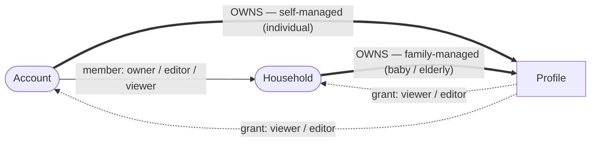
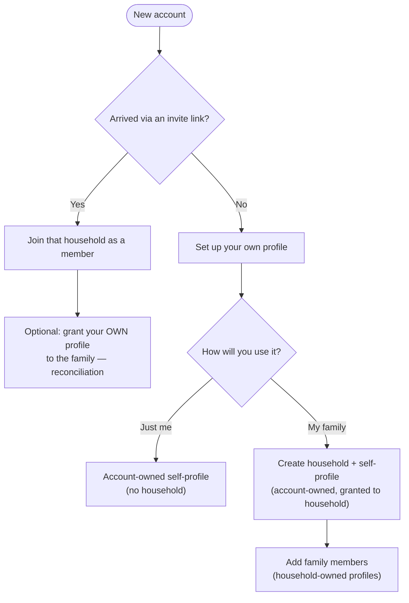
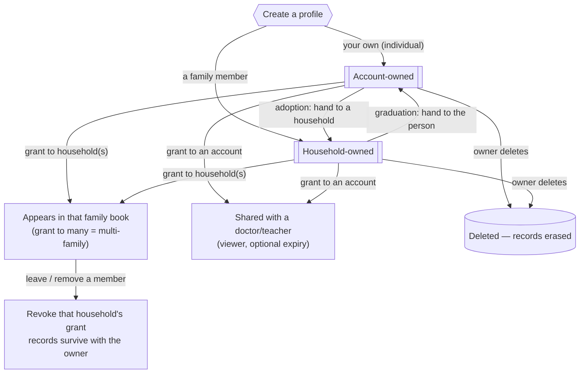

# Profile Management — Flow & Cases

The finalized **ownership + grants** model. A profile is **owned by exactly one** principal
(an account *or* a household) and **granted** to any number of households/accounts.

---

## 1. The model — ownership vs. access

- **Ownership** (`== bold ==`): exactly one — an account **or** a household.
- **Grants** (`-. dotted .->`): zero-to-many — to whole households (family book) or single accounts (a doctor).
- **You can see a profile if:** you own it · you're a member of its owner-household · it's granted to a household you're in · it's granted to your account. *Edit* if that path is owner/editor.

---

## 2. Sign-up → first profile

---

## 3. Profile lifecycle — every management case

---

## 4. Case → mechanism (nothing left out)

| Case | Mechanism |
|---|---|
| Use the app individually | **Account-owned** self-profile, no household |
| Track a family | **Household-owned** member profiles |
| Your own health in the family book | Account-owned + **grant to the household** |
| Someone joins your family (reconciliation) | They **grant** their profile to your household |
| A person in two families (multi-family) | **Grant to multiple households** — same record, both see it |
| Share one person with a doctor/teacher | **Grant to an account** (viewer, expiry) |
| Child grows up (graduation) | **Transfer ownership**: household → their account; keep/drop the family grant |
| A no-login person gains a login (adoption reverse) | **Transfer ownership**: account ↔ household |
| Member leaves or is removed | **Revoke** their owned-profile grants — *non-destructive*, nothing deleted |
| Erase a person's records | **Delete profile** (owner/editor) — hard delete, cascades visits |

---

## 5. Rules baked in

- **Exactly one owner** per profile; **many grants**.
- **Only the owner** manages a profile's grants and ownership (anti-exfiltration).
- **Removal ≠ deletion** — leaving/removing a member only revokes grants; records leave with their owner. Deletion is a separate, explicit, owner action.
- Every household keeps **≥ 1 owner** (guards block orphaning).
